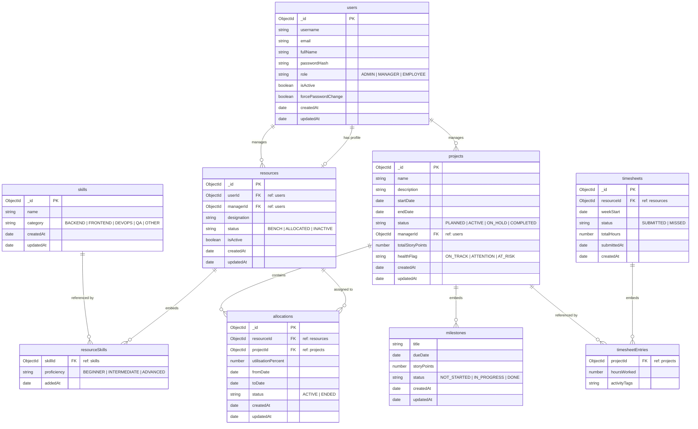

# Supplemental BRD: Transition from Employee to Resource

This supplemental Business Requirements Document (BRD) details the refactoring of the employee/resource management component in the PRM system.

---

## 1. Entity Renaming and Concept Shift
* **Rationale:** Conceptually, every person in the company (including Administrators and Managers) is an "Employee." The profile tracking details (skills, allocations, bench status) are only relevant to **individual contributors**, who are more accurately categorized as **Resources**.
* **Rename Rule:** The `Employee` entity is renamed to `Resource` globally:
  * Database collection: `employees` -> `resources`
  * Model & Interfaces: `Employee` -> `Resource`, `IEmployee` -> `IResource`
  * Repository: `EmployeeRepository` -> `ResourceRepository`
  * Service: `EmployeeService` -> `ResourceService`
  * API Routes: `/api/employees` -> `/api/resources`
  * Frontend API Slices and Hooks: `useGetEmployeesQuery` -> `useGetResourcesQuery`, etc.

---

## 2. Schema Refactoring & Moving Fields
To avoid data redundancy and maintain proper relational integrity:
* **User Collection (`users`):**
  * `fullName` is moved from the `Employee` table to the `User` table:
    * `fullName`: String (Required, Trimmed)
  * `email` remains on the `User` table as a unique authentication identifier.
* **Resource Collection (`resources`):**
  * `fullName` and `email` are **removed** from the `Resource` table.
  * The name and email details are resolved/populated from the linked `User` record via `userId`.
  * `department` is **removed** from the `Resource` table entirely as it is no longer required.

---

## 3. Resource Designations
Resources can only be assigned to a specific set of roles/designations. The following are the allowed designations:
1. `Junior Software Engineer`
2. `Software Engineer`
3. `Senior Software Engineer`
4. `Devops Engineer`
5. `Senior Devops engineer`
6. `UI Tester`
7. `Senior UI Tester`

* **User Provisioning Flow:** When an Admin creates a new User with the role of `EMPLOYEE`, the designation must be selected from this set of options. No `Resource` profile is created for `MANAGER` or `ADMIN` users.

---

## 4. Architectural System Diagrams

### Class Diagram (Mermaid)

```mermaid
classDiagram
  %% Data Access Interfaces (SOLID ISP & DIP)
  class IReadRepository~T~ {
    <<interface>>
    +findById(id: string) Promise~T | null~
    +findOne(filter: Object) Promise~T | null~
    +findAll(filter: Object) Promise~T[]~
  }

  class IWriteRepository~T~ {
    <<interface>>
    +create(data: Object) Promise~T~
    +updateById(id: string, data: Object) Promise~T | null~
    +deleteById(id: string) Promise~Boolean~
  }

  class IRepository~T~ {
    <<interface>>
  }
  IReadRepository~T~ <|-- IRepository~T~
  IWriteRepository~T~ <|-- IRepository~T~

  %% Base repository class
  class BaseRepository~T~ {
    <<abstract>>
    #model: Model
    +create(data: Object) Promise~T~
    +findById(id: string) Promise~T | null~
    +findOne(filter: Object) Promise~T | null~
    +findAll(filter: Object) Promise~T[]~
    +updateById(id: string, data: Object) Promise~T | null~
    +deleteById(id: string) Promise~Boolean~
  }
  IRepository~T~ <|.. BaseRepository~T~

  %% Concrete Repositories
  class UserRepository {
    +findByUsernameOrEmail(identifier: string) Promise~User | null~
    +deactivate(userId: string) Promise~User | null~
    +reactivate(userId: string) Promise~User | null~
  }
  BaseRepository~User~ <|-- UserRepository

  class ResourceRepository {
    +findByUserId(userId: string) Promise~Resource | null~
  }
  BaseRepository~Resource~ <|-- ResourceRepository

  class AllocationRepository {
    +findActiveAllocationsForResource(resourceId: string) Promise~Allocation[]~
    +findOverlappingAllocations(resourceId: string, from: Date, to: Date) Promise~Allocation[]~
    +findAllWithDetails(filter: Object) Promise~Allocation[]~
  }
  BaseRepository~Allocation~ <|-- AllocationRepository

  class ProjectRepository {
    +findAllWithManager() Promise~Project[]~
    +findByIdWithManager(id: string) Promise~Project | null~
  }
  BaseRepository~Project~ <|-- ProjectRepository

  class SkillRepository {
    +findByName(name: string) Promise~Skill | null~
  }
  BaseRepository~Skill~ <|-- SkillRepository

  class SystemConfigRepository {
    +getConfig() Promise~SystemConfig | null~
  }
  BaseRepository~SystemConfig~ <|-- SystemConfigRepository

  %% Business Services
  class AuthService {
    -userRepo: IRepository~User~
    +login(identifier: string, password: string) Promise~TokenPayload~
    +changePassword(userId: string, newPassword: string) Promise~TokenPayload~
    +issueSessionCookie(res: Response, payload: TokenPayload) void
    +clearSessionCookie(res: Response) void
  }

  class UserService {
    -userRepo: UserRepository
    -resourceRepo: ResourceRepository
    -allocationRepo: AllocationRepository
    +createUser(fullName: string, email: string, username: string, passwordTemp: string, role: string, designation: string) Promise~User~
    +getAllUsers() Promise~User[]~
    +reactivateUser(userId: string) Promise~User~
    +deactivateUser(userId: string, requestingUserId: string) Promise~User~
    +resetPassword(userId: string, newPasswordTemp: string) Promise~User~
  }

  class ResourceService {
    -resourceRepo: ResourceRepository
    -userRepo: UserRepository
    -skillRepo: SkillRepository
    -allocationRepo: AllocationRepository
    +getAllResources(filters: Object) Promise~Resource[]~
    +getResourceById(id: string) Promise~Resource | null~
    +deactivateResource(resourceId: string, requestingUserId: string) Promise~Resource~
    +addResourceSkill(resourceId: string, name: string, category: string, proficiency: string) Promise~Resource~
    +updateResourceSkill(resourceId: string, skillId: string, proficiency: string) Promise~Resource~
    +removeResourceSkill(resourceId: string, skillId: string) Promise~Resource~
    +assignManager(resourceUserId: string, managerUserId: string) Promise~Resource~
  }

  class ProjectService {
    -projectRepo: ProjectRepository
    -userRepo: UserRepository
    +createProject(data: Object) Promise~Project~
    +getAllProjects() Promise~Project[]~
    +getProjectById(projectId: string) Promise~Project | null~
    +updateProject(projectId: string, data: Object) Promise~Project~
    +addMilestone(projectId: string, title: string, dueDate: Date, storyPoints: number) Promise~Project~
    +updateMilestoneStatus(projectId: string, milestoneId: string, status: string) Promise~Project~
  }

  class AllocationService {
    -allocationRepo: AllocationRepository
    +getAllAllocations(filters: Object) Promise~Allocation[]~
  }

  class SystemConfigService {
    -systemConfigRepo: SystemConfigRepository
    +getConfig() Promise~SystemConfig~
    +updateConfig(data: Object) Promise~SystemConfig~
  }

  %% Dependencies (DIP)
  AuthService --> IRepository : depends
  UserService --> UserRepository : depends
  UserService --> ResourceRepository : depends
  UserService --> AllocationRepository : depends
  ResourceService --> ResourceRepository : depends
  ResourceService --> UserRepository : depends
  ResourceService --> SkillRepository : depends
  ResourceService --> AllocationRepository : depends
  ProjectService --> ProjectRepository : depends
  ProjectService --> UserRepository : depends
  AllocationService --> AllocationRepository : depends
  SystemConfigService --> SystemConfigRepository : depends
```



### Entity Relationship Diagram (Mermaid)


### 3. dbdiagram.io Database Markup Language (DBML) Schema
If you use [dbdiagram.io](https://dbdiagram.io) to render your database design, copy and paste the following DBML code:

```dbml
Table users {
  id varchar [pk]
  username varchar [unique, not null]
  email varchar [unique, not null]
  fullName varchar [not null]
  passwordHash varchar [not null]
  role varchar [note: 'ADMIN | MANAGER | EMPLOYEE']
  isActive boolean [default: true]
  forcePasswordChange boolean [default: true]
  createdAt timestamp
  updatedAt timestamp
}

Table resources {
  id varchar [pk]
  userId varchar [unique, not null]
  managerId varchar [null]
  designation varchar [not null]
  status varchar [default: 'BENCH', note: 'BENCH | ALLOCATED | INACTIVE']
  isActive boolean [default: true]
  createdAt timestamp
  updatedAt timestamp
}

Table resourceSkills {
  resourceId varchar
  skillId varchar
  proficiency varchar [note: 'BEGINNER | INTERMEDIATE | ADVANCED']
  addedAt timestamp
}

Table skills {
  id varchar [pk]
  name varchar [unique, not null]
  category varchar [note: 'BACKEND | FRONTEND | DEVOPS | QA | OTHER']
  createdAt timestamp
  updatedAt timestamp
}

Table allocations {
  id varchar [pk]
  resourceId varchar [not null]
  projectId varchar [not null]
  utilisationPercent number [not null]
  fromDate timestamp [not null]
  toDate timestamp [not null]
  status varchar [default: 'ACTIVE', note: 'ACTIVE | ENDED']
  createdAt timestamp
  updatedAt timestamp
}

Table projects {
  id varchar [pk]
  name varchar [not null]
  description text
  startDate timestamp [not null]
  endDate timestamp [not null]
  status varchar [default: 'PLANNED', note: 'PLANNED | ACTIVE | ON_HOLD | COMPLETED']
  managerId varchar [not null]
  totalStoryPoints number [default: 0]
  healthFlag varchar [default: 'ON_TRACK', note: 'ON_TRACK | ATTENTION | AT_RISK']
  createdAt timestamp
  updatedAt timestamp
}

Table milestones {
  projectId varchar
  title varchar [not null]
  dueDate timestamp [not null]
  storyPoints number [default: 0]
  status varchar [default: 'NOT_STARTED', note: 'NOT_STARTED | IN_PROGRESS | DONE']
  createdAt timestamp
  updatedAt timestamp
}

Table timesheets {
  id varchar [pk]
  resourceId varchar [not null]
  weekStart timestamp [not null]
  status varchar [default: 'SUBMITTED', note: 'SUBMITTED | MISSED']
  totalHours number [default: 0]
  submittedAt timestamp [null]
  createdAt timestamp
}

Table timesheetEntries {
  timesheetId varchar
  projectId varchar
  hoursWorked number [not null]
  activityTags varchar
}

Table systemConfig {
  id number [pk]
  llmProvider varchar [default: 'Gemini']
  llmApiKey varchar [not null]
  schedulerIntervalHours number [default: 4]
  maxWeeklyHours number [default: 40]
  updatedAt timestamp
}

// Relationships & Foreign Keys
Ref: resources.userId - users.id
Ref: resources.managerId > users.id
Ref: projects.managerId > users.id
Ref: allocations.resourceId > resources.id
Ref: allocations.projectId > projects.id
Ref: resourceSkills.resourceId > resources.id
Ref: resourceSkills.skillId > skills.id
Ref: milestones.projectId > projects.id
Ref: timesheets.resourceId > resources.id
Ref: timesheetEntries.timesheetId > timesheets.id
Ref: timesheetEntries.projectId > projects.id
```
