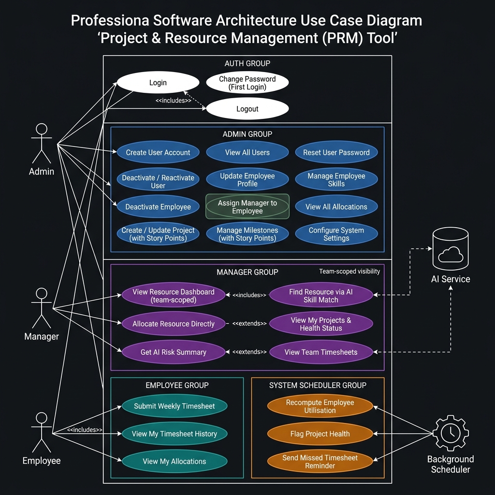

# Use Case Diagram — Project & Resource Management (PRM) Tool

## Overview

The Use Case Diagram captures **who interacts with the system (actors)** and **what they can do (use cases)**. It is the highest-level view of functional scope — used to align stakeholders on what the system delivers before any technical decisions are made.

---

## Diagram



---

## Actors

| Actor | Description |
|-------|-------------|
| **Admin** | System operator (HR/Ops). Manages master data — users, employees, projects. Does NOT manage day-to-day allocations. |
| **Manager** | Delivery manager. Allocates resources, monitors project health, uses AI features. Primary power user. Visibility is scoped to their own assigned team only. |
| **Employee** | Individual contributor. Submits timesheets, views own allocations. Most restricted role. |
| **AI Service** | External LLM (Google Gemini / Groq). Not a human actor — invoked by the system to power skill matching and risk summaries. |
| **Background Scheduler** | A system actor. Runs automatically at configured intervals to recompute utilisation and health flags. |

---

---

## Use Case Descriptions

### Authentication Use Cases (All Roles)

| Use Case | Actors | Description |
|----------|--------|-------------|
| **Login** | Admin, Manager, Employee | User enters credentials. Server validates. If `force_password_change = true`, user is redirected to Change Password before any menu is shown. |
| **Change Password (First Login)** | Admin, Manager, Employee | Mandatory on first login for all Admin-created accounts. Cannot be skipped. Sets `force_password_change = false` on success. |
| **Logout** | Admin, Manager, Employee | Clears session and returns to the Application Start screen. |

---

### Admin Use Cases

| Use Case | Description | Key Rules |
|----------|-------------|-----------|
| **Create User Account** | Creates login credentials for Admin, Manager, or Employee. Only way to create accounts — no self-registration. | Username and email must be unique. Temp password must meet strength rules (8+ chars, uppercase, number). |
| **View All Users** | Lists all users with role and active/inactive status. Allows reactivation. | Shows Total, Active, Inactive counts. |
| **Reset User Password** | Admin sets a new temporary password for any user. | User is forced to change it on next login. |
| **Deactivate / Reactivate User** | Blocks or restores login access. | Data is never deleted. Previous allocations are NOT restored on reactivation. |
| **Update Employee Profile** | Updates an existing employee's work profile (name, department, designation, etc.). | Admin role itself does not need an employee profile. |
| **Assign Manager to Employee** | Links an employee to a specific manager by updating the `manager_id` field on the employee record. | Employee User ID and Manager User ID must both exist in the system. This determines which manager's team the employee belongs to. |
| **Deactivate Employee** | Marks employee as inactive, ends all active allocations immediately, blocks linked user login. | Historical data is preserved. |
| **Manage Employee Skills** | Add, update proficiency, or remove skills from an employee. Skills have a category (Backend, Frontend, DevOps, QA, Other) and proficiency level (Beginner, Intermediate, Advanced). | Category cannot be blank. One proficiency record per skill per employee. |
| **Create / Update Project** | Creates a new project with Name, Description, Start/End Dates, Status (PLANNED/ACTIVE/ON_HOLD), assigned Manager, and Total Story Points. Also allows updating all project details including story points. | End date must be after start date. Total Story Points must be specified at creation. |
| **Manage Milestones** | Add milestones to projects (with title, due date, and story points), update milestone status (NOT_STARTED, IN_PROGRESS, DONE). | Milestone status and story points are used by the scheduler to detect overdue items and compute project progress. |
| **View All Allocations** | Read-only view of the full company-wide allocation matrix. | Cannot allocate or de-allocate from this screen. |
| **Configure System Settings** | Update LLM Provider (Gemini/Groq), API Key, Scheduler Interval, Max Weekly Hours. | |


---

### Manager Use Cases

> **Manager Visibility Scope:** All Manager use cases that involve employee data (Resource Dashboard, Allocate Resource, Timesheets) are **scoped to the Manager's own assigned team only**. Managers cannot view or allocate employees from other teams. There is no company-wide employee visibility for Managers.

| Use Case | Description | Key Rules |
|----------|-------------|-----------|
| **View Resource Dashboard** | Shows bench employees (fully available), active employees with utilisation %, and summary stats — **scoped to manager's team**. | Drill-down into individual employee showing skills, allocations, and recent activity tags. |
| **Find Resource via AI Skill Match** | Manager types a natural-language requirement. System filters eligible candidates by capacity (within manager's team), then calls AI for ranked recommendations. | AI is called only after human-readable filtering. Results are suggestions — not final decisions. |
| **Allocate Resource Directly** | Manager knows who they want — skips AI and allocates directly by Employee ID. Employee must belong to manager's team. | Same server-side validation applies: no over-allocation (>100%), valid date range, project must be ACTIVE/PLANNED. |
| **End Existing Allocation** | Ends an active allocation immediately. Sets `to_date` to today and recomputes employee status immediately. | Only the Manager who owns the project can end its allocations. Status update is immediate (not scheduler-triggered). |
| **View My Projects & Health Status** | Lists Manager's own projects with health flags (🔴 AT RISK, 🟡 ATTENTION, 🟢 ON TRACK). Drill-down shows milestones (with story points), resources, and risk flags. | Health flags are computed by the background scheduler. |
| **Get AI Risk Summary** | Calls AI with project milestone status + timesheet effort data. Returns a plain-English risk paragraph. | AI-generated; to be used alongside manager judgment. |
| **View Team Timesheets** | Read-only view of submitted timesheets for the Manager's team, filterable by week. Shows MISSED flag for unfiled weeks. | No approve/reject action in the console. Scoped to manager's own team. |

---

### Employee Use Cases

| Use Case | Description | Key Rules |
|----------|-------------|-----------|
| **Submit Weekly Timesheet** | Log hours worked per allocated project for a given week. Select activity tags (Microservices, Backend API, etc.). | Cannot log hours for projects not allocated to. Per-project hours capped at `allocation% × max_weekly_hours`. Total cannot exceed max weekly hours (default 40). Cannot submit for future weeks. Cannot submit twice for same week. |
| **View My Timesheet History** | View own submitted timesheets with status (SUBMITTED / MISSED). Drill into any week for project-level breakdown. | Read-only. |
| **View My Allocations** | View own active and historical allocations with utilisation %, date ranges, and status. | Read-only. |

---

### System (Background Scheduler) Use Cases

| Use Case | Description | Trigger |
|----------|-------------|---------|
| **Recompute Employee Utilisation** | Sums all active overlapping allocations per employee. Sets status to BENCH if total = 0%, ALLOCATED otherwise. | Runs at configured interval (default: every 4 hours). |
| **Flag Project Health** | Checks each active project: overdue milestones, low hour logs vs. expected, resource allocation gaps. Sets 🔴/🟡/🟢 flag. Story points completion ratio is factored in. | Runs at same scheduled interval. |
| **Send Missed Timesheet Reminder** | Detects employees with no timesheet for the most recent completed week. Surfaces reminder on next Employee login. | Runs at scheduled interval or on login event. |

---

## Inclusion & Extension Relationships

```
"Find Resource via AI"   <<includes>>  "Filter by Capacity (team-scoped)"
"Find Resource via AI"   <<includes>>  "Call AI Service"
"Get AI Risk Summary"    <<includes>>  "Collect Milestone + Timesheet Data"
"Get AI Risk Summary"    <<includes>>  "Call AI Service"
"Deactivate Employee"    <<extends>>   "Deactivate User"       ← also blocks login
"Login"                  <<extends>>   "Change Password"       ← only if force_password_change = true
"Submit Timesheet"       <<includes>>  "Validate Allocation Membership"
"Submit Timesheet"       <<includes>>  "Validate Hour Limits"
"Assign Manager"         <<includes>>  "Validate User IDs Exist"
```

---

## Key Architectural Observations (for Team Presentation)

1. **Strict Role Isolation**: Each role sees an entirely different set of use cases. There is no overlap in write capabilities — Admin manages data, Manager manages operations, Employee manages only their own records.

2. **Manager Team Scoping (V4 addition)**: Managers are explicitly scoped to their assigned team via the `manager_id` field on the Employee record. Cross-team employee visibility is blocked at the server level.

3. **Story Points as Project Progress Metric (V4 addition)**: Projects and milestones now track story points, enabling both the View All Projects list and the Manage Milestones screen to show `SP Done / Total` ratios — giving Admin and Managers a progress indicator beyond milestone status alone.

4. **AI is a Supporting Actor, Not a Decision Maker**: The AI Service is invoked after the system performs its own filtering. This keeps AI latency and cost to a minimum and ensures that recommendations are grounded in real data.

5. **Background Scheduler is a First-Class System Actor**: Health flagging and utilisation computation happen automatically — managers don't need to manually refresh anything. This is architecturally important: it means the system has a stateful, time-aware component.

6. **No Self-Registration**: All accounts are created by Admin only. This enforces organizational governance — you cannot join the system without an Admin creating your account.

7. **Soft Deletes Only**: Deactivation never deletes data. All historical records (timesheets, allocations) are always preserved. This is critical for billing accuracy and audit trails.
