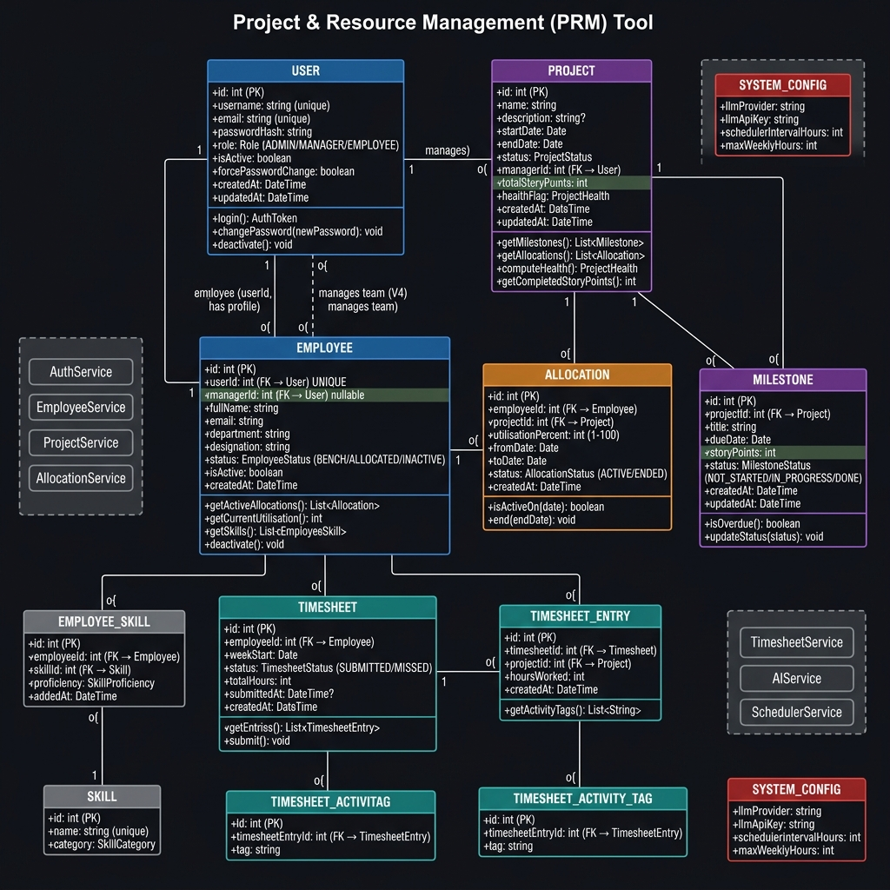

# Class Diagram — Project & Resource Management (PRM) Tool

## Overview

The Class Diagram defines the **static structure** of the system — the domain entities (classes), their attributes, methods, and relationships. Think of this as the blueprint for both the database schema and the object model used throughout the backend services.

This diagram follows a layered domain model approach: **Entities → Services → Repositories**, aligned with SOLID principles as required by the BRD.

---

## Diagram

---

## Entity Descriptions

### Core Entities

#### `User`
The **authentication identity** of a person in the system. Every person who can log in has a User record.

| Attribute | Type | Purpose |
|-----------|------|---------|
| `id` | int (PK) | Unique identifier |
| `username` | string (unique) | Login identifier |
| `email` | string (unique) | Contact and identity |
| `passwordHash` | string | Bcrypt/hashed password — never stored plain |
| `role` | Role (enum) | Determines which menu the user sees: ADMIN / MANAGER / EMPLOYEE |
| `isActive` | boolean | Controls login access. False = blocked |
| `forcePasswordChange` | boolean | Set to true when Admin creates account. Must change on first login. |
| `createdAt` | DateTime | Record creation timestamp |
| `updatedAt` | DateTime | Last modification timestamp |

**Methods:** `login(): AuthToken`, `changePassword(newPassword): void`, `deactivate(): void`

> **Design Note:** Admin accounts **do not** have an `Employee` profile. The `User` entity represents the login layer; `Employee` represents the operational/work profile.

---

#### `Employee`
The **work profile** of an individual contributor or manager. Linked to a `User` via `userId`.

| Attribute | Type | Purpose |
|-----------|------|---------|
| `id` | int (PK) | Unique identifier |
| `userId` | int (FK, UNIQUE) | Links to the `User` record — one-to-one |
| `managerId` | int (FK → User.id, nullable) | Links to the Manager's `User` record. Determines which manager's team this employee belongs to. Used to scope Resource Dashboard and Allocate Resource views. |
| `fullName` | string | Display name shown in dashboards |
| `email` | string | Work email address |
| `department` | string | Used for grouping in Resource Dashboard |
| `designation` | string | Job title (Developer, Tester, etc.) |
| `status` | EmployeeStatus | BENCH / ALLOCATED / INACTIVE — computed by scheduler |
| `isActive` | boolean | Set to false on deactivation |
| `createdAt` | DateTime | Record creation timestamp |

**Methods:** `getActiveAllocations(): List<Allocation>`, `getCurrentUtilisation(): int`, `getSkills(): List<EmployeeSkill>`, `deactivate(): void`

> **Design Note:** `status` is **derived data** — it is recomputed by the `SchedulerService` based on active allocations. It is stored for fast read access on the Resource Dashboard.

> **Design Note (V4):** `managerId` enables **team-scoped visibility**. When a Manager opens the Resource Dashboard or Allocate Resource screen, the server filters employees by `manager_id = currentUser.id`. Admin assigns this via the new "Assign Manager" screen.

---

#### `Project`
Represents a client-facing delivery project managed by a Manager.

| Attribute | Type | Purpose |
|-----------|------|---------|
| `id` | int (PK) | Unique identifier |
| `name` | string | Project display name |
| `description` | string (nullable) | Optional free-text description |
| `startDate` | Date | Project start date |
| `endDate` | Date | Project end date (must be after startDate) |
| `status` | ProjectStatus | PLANNED / ACTIVE / ON_HOLD / COMPLETED |
| `managerId` | int (FK → User.id) | The Manager responsible for this project |
| `totalStoryPoints` | int | Total story points for the project. Set at creation and updatable. Provides an overall size estimate. |
| `healthFlag` | ProjectHealth | ON_TRACK / ATTENTION / AT_RISK — set by scheduler |
| `createdAt` | DateTime | Record creation timestamp |
| `updatedAt` | DateTime | Last modification timestamp |

**Methods:** `getMilestones(): List<Milestone>`, `getAllocations(): List<Allocation>`, `computeHealth(): ProjectHealth`, `updateStatus(status): void`, `getCompletedStoryPoints(): int`

> **Design Note:** `healthFlag` is set by the `SchedulerService` using milestone status + timesheet effort analysis. Storing it in the DB avoids recalculating on every manager login.

> **Design Note (V4):** `totalStoryPoints` is admin-defined. The `getCompletedStoryPoints()` method aggregates `storyPoints` from all milestones with `status = DONE` — this powers the `SP Done/Total` display in the View All Projects screen.

---

#### `Milestone`
A key deliverable checkpoint within a project.

| Attribute | Type | Purpose |
|-----------|------|---------|
| `id` | int (PK) | Unique identifier |
| `projectId` | int (FK → Project.id) | The parent project |
| `title` | string | Milestone name (e.g., "Backend API", "Go Live") |
| `dueDate` | Date | Used by scheduler to detect overdue milestones |
| `storyPoints` | int | Story points allocated to this milestone. Used to compute project progress (Done SP / Total SP). |
| `status` | MilestoneStatus | NOT_STARTED / IN_PROGRESS / DONE |
| `createdAt` | DateTime | Record creation timestamp |
| `updatedAt` | DateTime | Last modification timestamp |

**Methods:** `isOverdue(): boolean`, `updateStatus(status: MilestoneStatus): void`

> **Design Note:** `isOverdue()` is a computed method — returns true if `status != DONE && dueDate < today`.

> **Design Note (V4):** `storyPoints` per milestone enables the progress summary shown on the Manage Milestones screen: `Total: X SP | Completed: Y SP | Remaining: Z SP`. The sum of all milestone `storyPoints` for a project should equal the project's `totalStoryPoints`.

---

#### `Allocation`
The record of an employee being assigned to a project at a specific utilisation %.

| Attribute | Type | Purpose |
|-----------|------|---------|
| `id` | int (PK) | Unique identifier |
| `employeeId` | int (FK → Employee.id) | The allocated employee |
| `projectId` | int (FK → Project.id) | The target project |
| `utilisationPercent` | int | 1–100. Sum of all overlapping allocations cannot exceed 100. |
| `fromDate` | Date | Start of the allocation |
| `toDate` | Date | End of the allocation |
| `status` | AllocationStatus | ACTIVE or ENDED |
| `createdAt` | DateTime | Record creation timestamp |
| `updatedAt` | DateTime | Last modification timestamp |

**Methods:** `isActiveOn(date: Date): boolean`, `end(endDate: Date): void`

> **Business Rule:** Total `utilisationPercent` across all `ACTIVE` allocations for the same employee, in any overlapping date range, cannot exceed 100. This is enforced by `AllocationService.validateAllocation()`.

---

#### `Timesheet`
One timesheet per employee per week. Tracks submission status.

| Attribute | Type | Purpose |
|-----------|------|---------|
| `id` | int (PK) | Unique identifier |
| `employeeId` | int (FK → Employee.id) | The submitting employee |
| `weekStart` | Date | Always a Monday. Used as the unique weekly key per employee. |
| `status` | TimesheetStatus | SUBMITTED or MISSED |
| `totalHours` | int | Computed sum of all entries. Cannot exceed `SystemConfig.maxWeeklyHours`. |
| `submittedAt` | DateTime (nullable) | Null for MISSED records |
| `createdAt` | DateTime | Record creation timestamp |

**Methods:** `getEntries(): List<TimesheetEntry>`, `submit(): void`

> **Business Rule:** Only one Timesheet record per `(employeeId, weekStart)` combination. Duplicate submission is rejected by the server.

---

#### `TimesheetEntry`
Individual project-level entry within a timesheet.

| Attribute | Type | Purpose |
|-----------|------|---------|
| `id` | int (PK) | Unique identifier |
| `timesheetId` | int (FK → Timesheet.id) | Parent timesheet |
| `projectId` | int (FK → Project.id) | Project hours are logged against |
| `hoursWorked` | int | Hours on this specific project this week |
| `createdAt` | DateTime | Record creation timestamp |

**Methods:** `getActivityTags(): List<String>`

> **Design Note:** Activity tags are stored in the separate `TimesheetActivityTag` entity (not as a list field here). This allows efficient querying for AI Skill Matching.

---

#### `TimesheetActivityTag`
Stores one activity tag per row, linked to a `TimesheetEntry`. Normalised into its own table for efficient querying.

| Attribute | Type | Purpose |
|-----------|------|---------|
| `id` | int (PK) | Unique identifier |
| `timesheetEntryId` | int (FK → TimesheetEntry.id) | Parent entry |
| `tag` | string | e.g., "Microservices", "WebSocket", "Bug Fixing" — feeds the AI Skill Matcher |

> **Design Note:** Tags are the **core data source for AI Skill Matching**. They capture real on-the-job skill usage, making them more accurate than static profile skills set at onboarding.

---

#### `EmployeeSkill` (Join Entity)
Maps an employee to a skill with a proficiency level. This is a rich join table — not just a foreign key.

| Attribute | Type | Purpose |
|-----------|------|---------|
| `id` | int (PK) | Unique identifier |
| `employeeId` | int (FK → Employee.id) | The employee |
| `skillId` | int (FK → Skill.id) | The skill |
| `proficiency` | SkillProficiency | BEGINNER / INTERMEDIATE / ADVANCED |
| `addedAt` | DateTime | When this skill was added to the employee |

> **Unique Constraint:** `(employeeId, skillId)` — one proficiency record per skill per employee.

---

#### `SystemConfig`
A singleton configuration table. Only one row ever exists.

| Attribute | Type | Purpose |
|-----------|------|---------|
| `llmProvider` | string | "Gemini" or "Groq" |
| `llmApiKey` | string | Stored securely; masked in UI |
| `schedulerIntervalHours` | int | How often the background scheduler runs |
| `maxWeeklyHours` | int | Maximum hours any employee can log in a week (default: 40) |

---

## Service Layer Descriptions

> **Key Design Point:** Services have **dashed borders** in the class diagram and contain **only methods** (no data attributes). They depend on entity classes but are never stored in the database themselves. This follows the **Single Responsibility Principle** and **Service Layer pattern**.

| Service | Key Methods | Responsibility |
|---------|-------------|---------------|
| `AuthService` | `login()`, `logout()`, `changePassword()`, `validateToken()`, `resetPassword()` | Login, logout, token validation, password change/reset |
| `EmployeeService` | `updateEmployee()`, `deactivateEmployee()`, `assignManager()`, `addSkill()`, `updateSkill()`, `removeSkill()` | CRUD for employees and their skills; manager assignment |
| `ProjectService` | `createProject()`, `updateProject()`, `addMilestone()`, `updateMilestone()`, `getStoryPointProgress()` | CRUD for projects and milestones; story point aggregation |
| `AllocationService` | `allocate()`, `validateAllocation()`, `endAllocation()`, `getAllocationMatrix()`, `getTeamAllocations(managerId)` | Allocation creation, over-allocation validation, ending allocations, team-scoped and company-wide matrix |
| `TimesheetService` | `submitTimesheet()`, `getTimesheetByEmployee()`, `getTeamTimesheets(managerId)`, `getMissedTimesheets()` | Timesheet submission, validation, retrieval for employee and manager views (team-scoped) |
| `AIService` | `matchResources()`, `generateRiskSummary()` | Builds prompts from system data, calls configured LLM provider, parses results |
| `SchedulerService` | `runRecomputeUtilisation()`, `runHealthFlagging()`, `runMissedTimesheetDetection()` | Background job orchestrator — runs all three scheduled phases |

---

## Key Design Decisions

### 1. Separation of `User` and `Employee`
These are intentionally separate entities. A `User` is an **authentication concept** (can log in). An `Employee` is a **business concept** (has a work profile, skills, allocations, timesheets). Admins need a User but not an Employee. This separation follows the **Single Responsibility Principle**.

### 2. `Employee.managerId` — Team Scoping (V4)
The new `managerId` field on `Employee` implements the Manager Visibility Scope introduced in V4. When a Manager accesses the Resource Dashboard or Allocate Resource screen, all employee queries are filtered by `WHERE manager_id = :currentManagerUserId`. This is enforced server-side — not just in the UI. `AllocationService.getTeamAllocations(managerId)` and `TimesheetService.getTeamTimesheets(managerId)` both accept this parameter.

### 3. Story Points on Projects and Milestones (V4)
`Project.totalStoryPoints` is the admin-defined total size of the project. `Milestone.storyPoints` represents each checkpoint's contribution. The `ProjectService.getStoryPointProgress()` method aggregates `SUM(story_points WHERE status = DONE)` for the `SP Done/Total` display in View All Projects and Manage Milestones. The sum of all milestone story points should equal the project's total story points.

### 4. Derived Status Fields (`Employee.status`, `Project.healthFlag`)
Rather than computing these on every read (which would be expensive), they are stored and updated by the `SchedulerService`. This is a deliberate **denormalisation for read performance** — a classic trade-off in operational systems.

### 5. Activity Tags as AI Data Source
`TimesheetEntry.activityTags` bridges the gap between static skill profiles and real skill usage. Over time, these tags become a richer signal for the AI Skill Matcher than anything the Admin could manually maintain.

### 6. Repository Pattern (Design Pattern from BRD)
Each entity should have a corresponding Repository interface (e.g., `EmployeeRepository`, `AllocationRepository`). Services depend on **interfaces**, not concrete database implementations — satisfying the **Dependency Inversion Principle (SOLID-D)**.

### 7. Singleton for SystemConfig
`SystemConfig` is a single-row configuration table. The `SchedulerService` and `AIService` both read from it. This is the **Singleton pattern** documented in the BRD's design pattern requirement.
