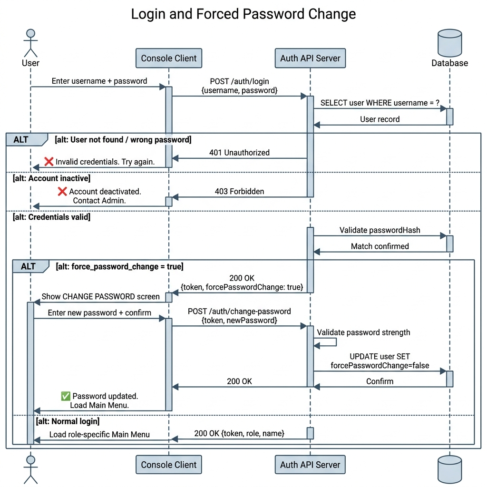
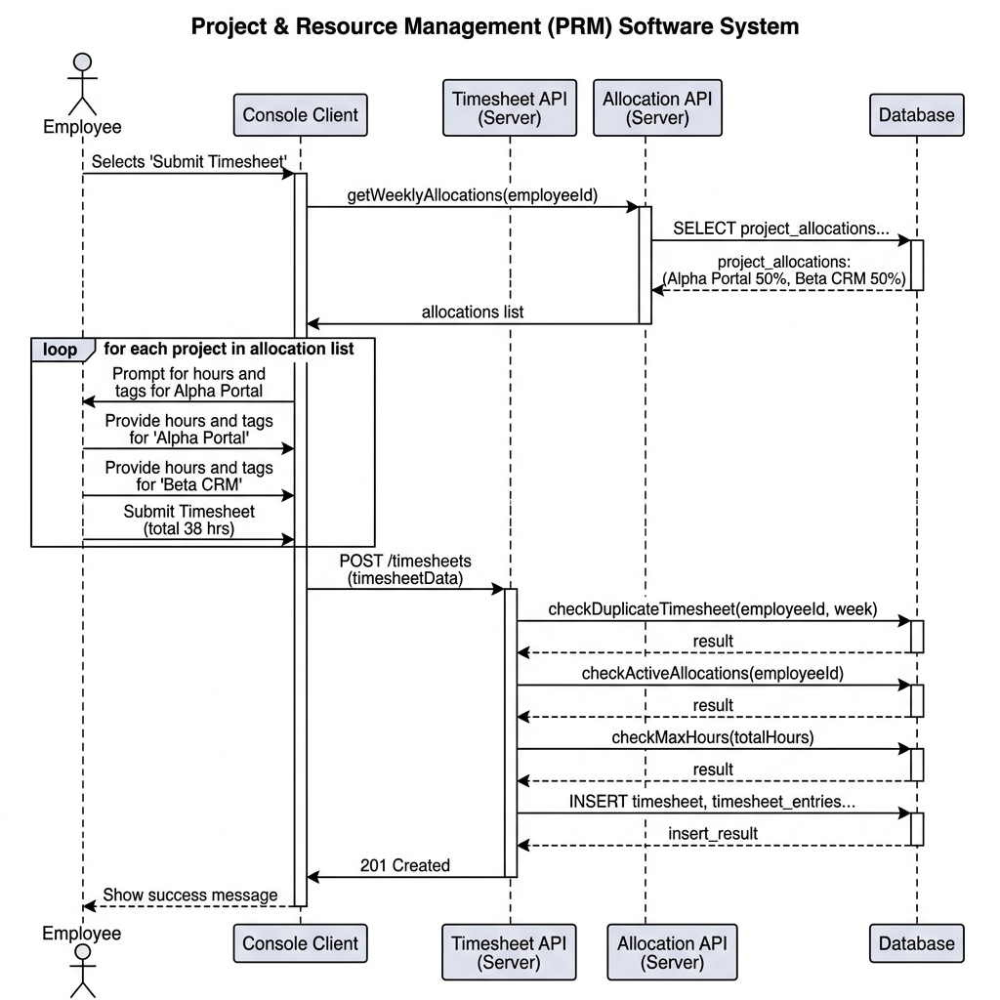
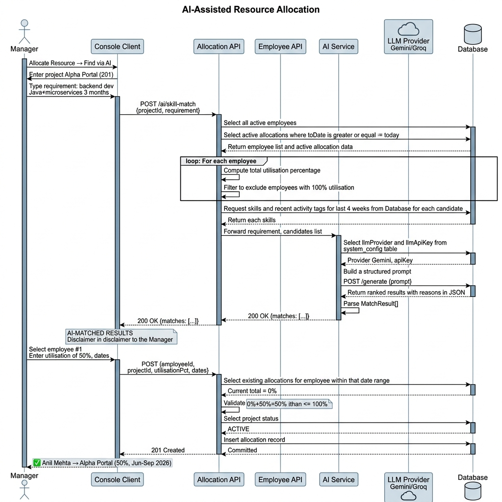
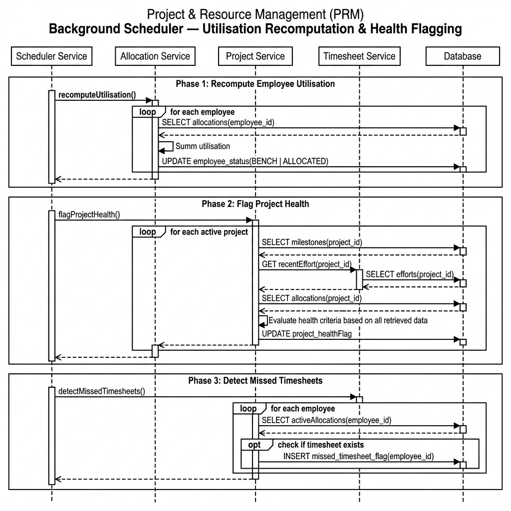
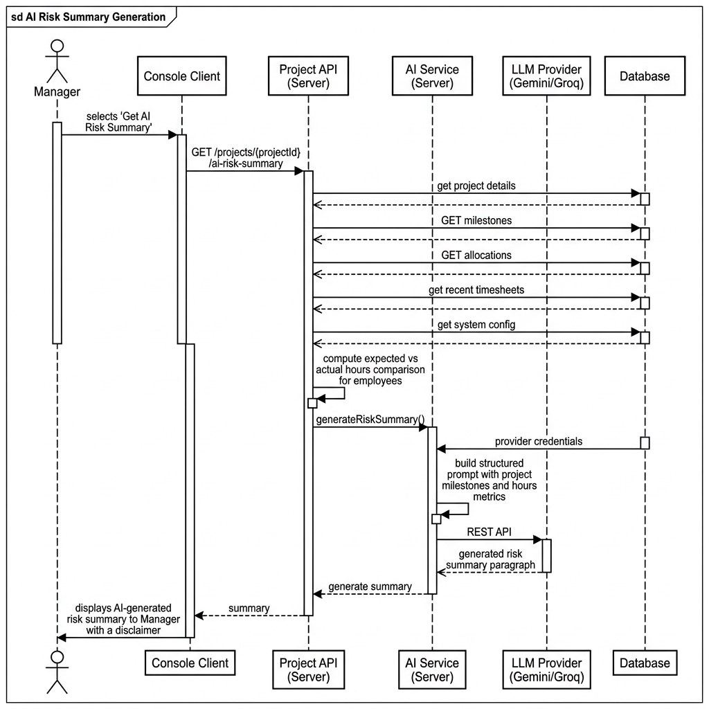

# Sequence Diagrams — Project & Resource Management (PRM) Tool

## Overview

Sequence Diagrams capture the **runtime interactions between system components** for specific use cases. They show the exact order of messages, API calls, database queries, and responses — making them the primary tool for understanding how the system behaves, not just what it stores.

The following critical flows have been chosen because they represent the highest complexity, highest risk, and most important behaviors in the PRM system:

1. **Login & Forced Password Change**
2. **Employee Timesheet Submission**
3. **AI-Assisted Resource Allocation**
4. **Background Scheduler — Utilisation Recomputation & Health Flagging**
5. **AI Risk Summary Generation**

---

## Flow 1: Login & Forced Password Change

This flow is the **entry gate** for all users. The forced password change is a security requirement for all Admin-created accounts and must not be bypassable.

**Key Points:**
- The server, not the client, determines whether password change is needed. The client cannot skip this step.
- The token is issued even before the password change — but only the `/auth/change-password` endpoint is accessible with a `forcePasswordChange` token. All other endpoints reject it.
- Password strength is validated server-side (8+ chars, uppercase, number).

---

## Flow 2: Employee Timesheet Submission

This is the most rule-heavy write operation in the system. Multiple server-side validations must pass before the timesheet is persisted.

**Key Points:**
- The client shows only projects the employee is allocated to (fetched from the server first).
- All business rule validation happens **on the server** — not just on the client. This prevents manipulation.
- Activity tags are stored per entry and will later feed the AI Skill Matcher.

---

## Flow 3: AI-Assisted Resource Allocation

This is the most architecturally interesting flow — it combines data retrieval, server-side pre-filtering (scoped to manager's team), and an external LLM API call.

**Key Points:**
- **AI is never called with raw database data.** The server pre-processes, filters, and summarizes before sending anything to the LLM. This reduces token usage and eliminates impossible suggestions.
- **Team-scoped filtering (V4):** Before any AI step, the server restricts candidates to employees whose `manager_id` matches the requesting manager. Employees from other teams are excluded regardless of their availability.
- **Two separate server calls**: one for AI matching, one for the actual allocation confirmation. AI output is advisory only.
- The LLM API key is **never exposed to the console client** — only the `AIService` on the server reads it.
- Allocation validation is enforced even after AI suggestion — the server never trusts the client to pre-validate.

---

## Flow 4: Background Scheduler — Utilisation Recomputation & Health Flagging

This flow runs **automatically on a configured interval** (default: every 4 hours). No user initiates it.

**Key Points:**
- The scheduler runs in **three sequential phases** to avoid stale data (utilisation must be updated before health flags are computed, because health flags depend on allocation data).
- `Employee.status` (BENCH/ALLOCATED) is a **cached derived value** — updated here, not recalculated on every dashboard load.
- The missed timesheet flag is stored in the database so it persists across server restarts and surfaces on the next employee login.
- **Story point progress (V4):** During health flagging, the scheduler also evaluates `SUM(milestone.story_points WHERE status = DONE)` vs `project.total_story_points` as an additional project health signal.

---

## Flow 5: AI Risk Summary Generation

Called when a Manager selects "Get AI Risk Summary" from My Projects or the AI Assistant screen.

**Key Points:**
- The server computes the **expected vs. actual hours comparison** before calling the LLM — this transforms raw numbers into meaningful context that the AI can interpret accurately.
- **Story points context (V4):** The server also includes completed vs. total story points in the prompt context (e.g., "40 of 120 SP done, 3 milestones remaining"), giving the AI richer project health signals.
- The AI is given **structured factual inputs**, not access to the database. The narrative is AI-generated; the facts are system-generated.
- The disclaimer is always shown — the manager should use this alongside their own project management judgment.

---

## Flow 6: End Allocation (Immediate Status Update)

When a Manager ends an allocation, the employee's status is **recomputed immediately** — not deferred to the next scheduler run.

**Key Points:**
- Manager calls `DELETE /allocations/:id` or `PATCH /allocations/:id/end`
- Server sets `allocation.to_date = today` and `allocation.status = ENDED`
- Server immediately checks remaining active allocations for this employee
- If no other active allocations exist, server sets `employee.status = BENCH` inline
- Response is returned to the client with the updated employee status

> **V3 vs V4:** In V3 this was described as "triggers the scheduler to recompute". In V4 the status update is **immediate** — the scheduler still runs periodically but the end-allocation path does not wait for it.

---

## Interaction Summary Table

| Flow | Initiator | Server Components Involved | External Calls |
|------|-----------|--------------------------|----------------|
| Login | User | AuthAPI, DB | None |
| Forced Password Change | User | AuthAPI, DB | None |
| Timesheet Submission | Employee | TimesheetAPI, AllocationAPI, DB | None |
| AI Skill Match | Manager | AllocationAPI, EmployeeAPI (team-scoped), AIService, DB | LLM Provider |
| Direct Allocation | Manager | AllocationAPI, DB | None |
| End Allocation | Manager | AllocationAPI, EmployeeAPI, DB | None |
| Background Scheduler | System (timer) | SchedulerService, AllocationAPI, ProjectAPI, TimesheetAPI, DB | None |
| AI Risk Summary | Manager | ProjectAPI, AIService, DB | LLM Provider |

---

## Key Architectural Takeaways

1. **Server is the single source of truth for all validation.** No client-side validation is trusted.
2. **AI calls are gated by data preprocessing.** The LLM is never called with raw database output — the server always builds a structured, filtered, and contextualised prompt.
3. **Background Scheduler is stateful and persistent.** All scheduler outputs (utilisation, health flags, missed timesheet flags) are written to the database — not held in memory.
4. **Two-phase allocation:** AI suggestion and actual allocation are separate API calls, separated by manager review.
5. **Security:** API keys, passwords, and tokens never flow to the console client beyond what's necessary.
6. **Team scoping is server-enforced (V4).** Manager-level queries always include a `manager_id` filter. Bypassing the UI cannot expose cross-team data.
7. **End allocation is immediate (V4).** Employee bench status is updated inline when an allocation ends — no scheduler delay.
