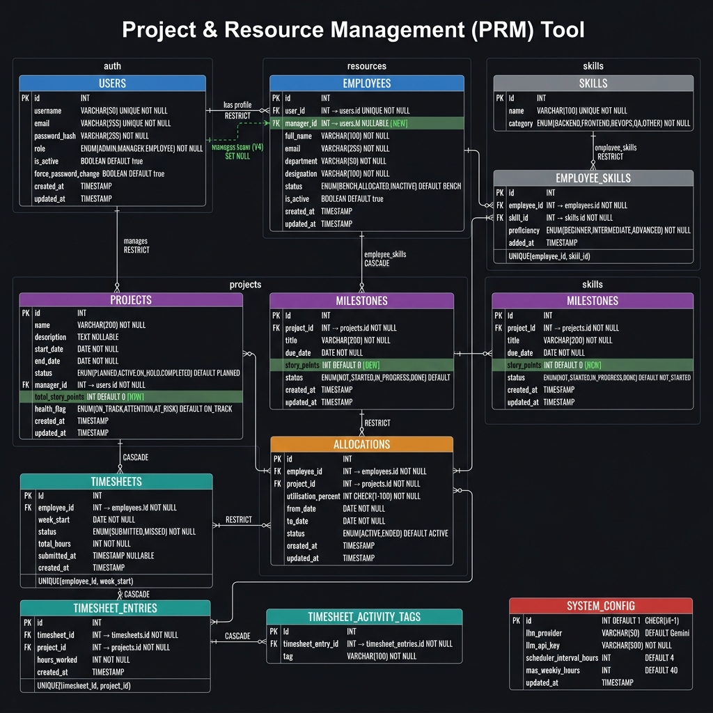

# ER Diagram — Project & Resource Management (PRM) Tool

## Overview

The Entity-Relationship (ER) Diagram defines the **relational database schema** for the PRM system. It specifies every table, every column with its data type and constraints, and every relationship between tables — including cardinality and foreign key references.

This is the ground truth for the database layer. Every entity in the Class Diagram maps to one or more tables here. The schema is designed to:
- Enforce referential integrity at the database level (not just in application code)
- Never hard-delete data (soft deletes via `is_active` / `status` fields)
- Support efficient querying for the Resource Dashboard, timesheet aggregation, and scheduler operations

---

## Full ER Diagram



---

## Table-by-Table Reference

### `users`

The authentication and access control table. Every person who can log into the system has exactly one row here.

| Column | Type | Constraints | Description |
|--------|------|-------------|-------------|
| `id` | INT | PK, AUTO_INCREMENT | Surrogate primary key |
| `username` | VARCHAR(50) | UNIQUE, NOT NULL | Login identifier |
| `email` | VARCHAR(255) | UNIQUE, NOT NULL | Contact email |
| `password_hash` | VARCHAR(255) | NOT NULL | Bcrypt hash — never plain text |
| `role` | ENUM | NOT NULL | ADMIN, MANAGER, or EMPLOYEE |
| `is_active` | BOOLEAN | NOT NULL, DEFAULT true | False = cannot log in |
| `force_password_change` | BOOLEAN | NOT NULL, DEFAULT true | Set true on account creation; cleared on first password change |
| `created_at` | TIMESTAMP | NOT NULL, DEFAULT NOW() | Record creation time |
| `updated_at` | TIMESTAMP | NOT NULL | Last modified time |

**Unique Constraints:** `(username)`, `(email)`

**Seed Data:** One row is inserted by a setup/migration script for the first Admin:
```sql
INSERT INTO users (username, email, password_hash, role, force_password_change)
VALUES ('admin', 'admin@techserve.com', '<bcrypt(Admin@1234)>', 'ADMIN', true);
```

---

### `employees`

The work profile for individual contributors and managers. Admins do not have an employee record.

| Column | Type | Constraints | Description |
|--------|------|-------------|-------------|
| `id` | INT | PK, AUTO_INCREMENT | |
| `user_id` | INT | FK → users.id, UNIQUE, NOT NULL | One-to-one link to the login identity |
| `manager_id` | INT | FK → users.id, NULLABLE | Links this employee to their Manager's user account. Used to scope Resource Dashboard and Allocate Resource views so managers only see their own team. Set via Admin's "Assign Manager" screen. |
| `full_name` | VARCHAR(100) | NOT NULL | Display name |
| `email` | VARCHAR(255) | NOT NULL | Work email (may differ from user email) |
| `department` | VARCHAR(50) | NOT NULL | Backend, Frontend, DevOps, QA, etc. |
| `designation` | VARCHAR(100) | NOT NULL | Job title |
| `status` | ENUM | NOT NULL, DEFAULT 'BENCH' | BENCH, ALLOCATED, or INACTIVE — managed by scheduler |
| `is_active` | BOOLEAN | NOT NULL, DEFAULT true | Set false on deactivation |
| `created_at` | TIMESTAMP | NOT NULL | |
| `updated_at` | TIMESTAMP | NOT NULL | |

**Unique Constraints:** `(user_id)` — one employee profile per user  
**Foreign Keys:**
- `user_id → users(id) ON DELETE RESTRICT`
- `manager_id → users(id) ON DELETE SET NULL` — if the manager user is deactivated, the field becomes NULL (employee is unassigned but not deleted)

> **Why `RESTRICT` on user_id delete?** Users are never hard-deleted. Deactivation sets `is_active = false`. `RESTRICT` is a safety net.

> **Why `SET NULL` on manager_id delete?** Losing the manager assignment is preferable to blocking manager deactivation. An unassigned employee (`manager_id = NULL`) will simply not appear in any Manager's scoped view until reassigned by Admin.

---

### `skills`

A master list of all skill types available in the system. Admin-managed.

| Column | Type | Constraints | Description |
|--------|------|-------------|-------------|
| `id` | INT | PK, AUTO_INCREMENT | |
| `name` | VARCHAR(100) | UNIQUE, NOT NULL | e.g. "Java", "React", "Kubernetes" |
| `category` | ENUM | NOT NULL | BACKEND, FRONTEND, DEVOPS, QA, OTHER |

**Unique Constraints:** `(name)`

---

### `employee_skills`

Many-to-many join table between employees and skills, enriched with proficiency level.

| Column | Type | Constraints | Description |
|--------|------|-------------|-------------|
| `id` | INT | PK, AUTO_INCREMENT | |
| `employee_id` | INT | FK → employees.id, NOT NULL | |
| `skill_id` | INT | FK → skills.id, NOT NULL | |
| `proficiency` | ENUM | NOT NULL | BEGINNER, INTERMEDIATE, ADVANCED |
| `added_at` | TIMESTAMP | NOT NULL, DEFAULT NOW() | |

**Unique Constraints:** `(employee_id, skill_id)` — one proficiency record per skill per employee  
**Foreign Keys:**
- `employee_id → employees(id) ON DELETE CASCADE` — deleting employee removes their skills
- `skill_id → skills(id) ON DELETE RESTRICT`

---

### `projects`

Represents a delivery project. Managed by a Manager user.

| Column | Type | Constraints | Description |
|--------|------|-------------|-------------|
| `id` | INT | PK, AUTO_INCREMENT | |
| `name` | VARCHAR(200) | NOT NULL | Project display name |
| `description` | TEXT | NULLABLE | Free text description |
| `start_date` | DATE | NOT NULL | |
| `end_date` | DATE | NOT NULL | Must be after start_date |
| `status` | ENUM | NOT NULL, DEFAULT 'PLANNED' | PLANNED, ACTIVE, ON_HOLD, COMPLETED |
| `manager_id` | INT | FK → users.id, NOT NULL | Must reference a user with role = MANAGER |
| `total_story_points` | INT | NOT NULL, DEFAULT 0, CHECK >= 0 | Admin-defined total story points for the project. Set at creation, editable via Update Project Details. The sum of all milestone story points should equal this value. |
| `health_flag` | ENUM | NOT NULL, DEFAULT 'ON_TRACK' | ON_TRACK, ATTENTION, AT_RISK — set by scheduler |
| `created_at` | TIMESTAMP | NOT NULL | |
| `updated_at` | TIMESTAMP | NOT NULL | |

**Check Constraints:** `end_date > start_date`, `total_story_points >= 0`  
**Foreign Keys:** `manager_id → users(id) ON DELETE RESTRICT`

---

### `milestones`

Key deliverable checkpoints within a project.

| Column | Type | Constraints | Description |
|--------|------|-------------|-------------|
| `id` | INT | PK, AUTO_INCREMENT | |
| `project_id` | INT | FK → projects.id, NOT NULL | |
| `title` | VARCHAR(200) | NOT NULL | e.g., "Backend API", "Go Live" |
| `due_date` | DATE | NOT NULL | Deadline for this milestone |
| `story_points` | INT | NOT NULL, DEFAULT 0, CHECK >= 0 | Story points allocated to this milestone. Powers the `SP Done/Total` display on View All Projects and the `Total SP | Completed SP | Remaining SP` summary on Manage Milestones. |
| `status` | ENUM | NOT NULL, DEFAULT 'NOT_STARTED' | NOT_STARTED, IN_PROGRESS, DONE |
| `created_at` | TIMESTAMP | NOT NULL | |
| `updated_at` | TIMESTAMP | NOT NULL | |

**Check Constraints:** `story_points >= 0`  
**Foreign Keys:** `project_id → projects(id) ON DELETE CASCADE`  
*(If a project is deleted — which shouldn't happen in normal operation — its milestones are also removed.)*

> **Story Point Aggregation Query:**
> ```sql
> -- Completed SP for a project
> SELECT SUM(story_points) FROM milestones
> WHERE project_id = ? AND status = 'DONE';
> 
> -- Remaining SP for a project
> SELECT SUM(story_points) FROM milestones
> WHERE project_id = ? AND status != 'DONE';
> ```

---

### `allocations`

Records an employee being assigned to a project at a specific utilisation percentage for a date range.

| Column | Type | Constraints | Description |
|--------|------|-------------|-------------|
| `id` | INT | PK, AUTO_INCREMENT | |
| `employee_id` | INT | FK → employees.id, NOT NULL | |
| `project_id` | INT | FK → projects.id, NOT NULL | |
| `utilisation_percent` | INT | NOT NULL, CHECK(1–100) | The % of working capacity committed to this project |
| `from_date` | DATE | NOT NULL | Start of allocation |
| `to_date` | DATE | NOT NULL | End of allocation |
| `status` | ENUM | NOT NULL, DEFAULT 'ACTIVE' | ACTIVE or ENDED |
| `created_at` | TIMESTAMP | NOT NULL | |
| `updated_at` | TIMESTAMP | NOT NULL | |

**Check Constraints:**
- `utilisation_percent BETWEEN 1 AND 100`
- `to_date >= from_date`

**Application-Level Constraint (enforced in `AllocationService`):**
```sql
-- Before inserting, sum existing ACTIVE allocations for this employee
-- where date ranges overlap with [from_date, to_date]:
SELECT SUM(utilisation_percent)
FROM allocations
WHERE employee_id = ?
  AND status = 'ACTIVE'
  AND from_date <= :new_to_date
  AND to_date >= :new_from_date;
-- Result + new utilisation_percent must not exceed 100
```

**Foreign Keys:**
- `employee_id → employees(id) ON DELETE RESTRICT`
- `project_id → projects(id) ON DELETE RESTRICT`

---

### `timesheets`

One row per employee per week. The header/summary record for a week's work log.

| Column | Type | Constraints | Description |
|--------|------|-------------|-------------|
| `id` | INT | PK, AUTO_INCREMENT | |
| `employee_id` | INT | FK → employees.id, NOT NULL | |
| `week_start` | DATE | NOT NULL | Always a Monday. The canonical identifier for a week. |
| `status` | ENUM | NOT NULL, DEFAULT 'SUBMITTED' | SUBMITTED or MISSED |
| `total_hours` | INT | NOT NULL | Sum of all entry hours for this week |
| `submitted_at` | TIMESTAMP | NULLABLE | When the employee submitted (null for MISSED records) |
| `created_at` | TIMESTAMP | NOT NULL | |

**Unique Constraints:** `(employee_id, week_start)` — one timesheet per week per employee  
**Check Constraints:** `total_hours >= 0`  
**Foreign Keys:** `employee_id → employees(id) ON DELETE RESTRICT`

> **Note on MISSED records:** When the scheduler detects a missed week, it inserts a timesheet row with `status = MISSED`, `total_hours = 0`, and `submitted_at = NULL`. This allows clean querying for compliance reporting.

---

### `timesheet_entries`

One row per project logged within a timesheet week. The detail lines of a timesheet.

| Column | Type | Constraints | Description |
|--------|------|-------------|-------------|
| `id` | INT | PK, AUTO_INCREMENT | |
| `timesheet_id` | INT | FK → timesheets.id, NOT NULL | |
| `project_id` | INT | FK → projects.id, NOT NULL | |
| `hours_worked` | INT | NOT NULL, CHECK >= 0 | Hours on this specific project this week |
| `created_at` | TIMESTAMP | NOT NULL | |

**Unique Constraints:** `(timesheet_id, project_id)` — one entry per project per timesheet  
**Foreign Keys:**
- `timesheet_id → timesheets(id) ON DELETE CASCADE`
- `project_id → projects(id) ON DELETE RESTRICT`

---

### `timesheet_activity_tags`

Stores the activity tags selected by an employee for each timesheet entry. Normalized into its own table to allow efficient querying and future analytics.

| Column | Type | Constraints | Description |
|--------|------|-------------|-------------|
| `id` | INT | PK, AUTO_INCREMENT | |
| `timesheet_entry_id` | INT | FK → timesheet_entries.id, NOT NULL | |
| `tag` | VARCHAR(100) | NOT NULL | e.g., "Microservices", "Backend API", "Bug Fixing" |

**Foreign Keys:** `timesheet_entry_id → timesheet_entries(id) ON DELETE CASCADE`

> **Why a separate table?** Activity tags are used by the AI Skill Matcher. Normalizing them into their own table allows efficient queries like:
> ```sql
> SELECT DISTINCT tag FROM timesheet_activity_tags tat
> JOIN timesheet_entries te ON tat.timesheet_entry_id = te.id
> JOIN timesheets t ON te.timesheet_id = t.id
> WHERE t.employee_id = ?
>   AND t.week_start >= DATE_SUB(NOW(), INTERVAL 28 DAY);
> ```

---

### `system_config`

A singleton table — exactly one row. Contains global system configuration.

| Column | Type | Constraints | Description |
|--------|------|-------------|-------------|
| `id` | INT | PK, DEFAULT 1 | Always 1 — enforced by CHECK(id = 1) |
| `llm_provider` | VARCHAR(50) | NOT NULL, DEFAULT 'Gemini' | "Gemini" or "Groq" |
| `llm_api_key` | VARCHAR(500) | NOT NULL | Encrypted or masked at rest |
| `scheduler_interval_hours` | INT | NOT NULL, DEFAULT 4 | How often the background scheduler runs |
| `max_weekly_hours` | INT | NOT NULL, DEFAULT 40 | Cap on total hours per employee per week |
| `updated_at` | TIMESTAMP | NOT NULL | |

**Check Constraints:** `id = 1`, `scheduler_interval_hours > 0`, `max_weekly_hours > 0`

---

## Relationship Summary

The diagram uses **simple "1" and "many" labels** on each relationship line — no symbols needed.

- **"1"** on a side means: exactly one record on that side
- **"many"** on a side means: zero or more records on that side
- **"0 or 1"** means: optional — zero or exactly one (used for optional one-to-one)
- **"many (min 1)"** means: at least one must exist (mandatory many)

---

### 🔴 One-to-One (1:1) Relationship

#### `users` → `employees` — "has profile"

| Side | Label | Meaning |
|------|-------|---------|
| USERS side | **1** | Every employee profile must link to exactly one user |
| EMPLOYEES side | **0 or 1** | A user may have zero employee profiles (Admin) or one (Manager/Employee) |

| Detail | Value |
|--------|-------|
| **FK Column** | `employees.user_id → users.id` |
| **UNIQUE constraint on** | `employees.user_id` — this is what makes it one-to-one |
| **On Delete** | RESTRICT |

> **Real-world meaning:** When Admin creates a Manager or Employee account (`users` row), they also need to set up the `employees` record (the work profile). Admins never get an employee row at all.

---

#### `users` → `employees` — "manages team" (V4)

| Side | Label | Meaning |
|------|-------|---------|
| USERS (Manager) side | **1** | Each employee has at most one assigned manager |
| EMPLOYEES side | **0 or many** | One manager can have many employees on their team |

| Detail | Value |
|--------|-------|
| **FK Column** | `employees.manager_id → users.id` |
| **UNIQUE constraint on** | None — multiple employees can share the same manager |
| **On Delete** | SET NULL — losing a manager user unassigns but does not delete employees |

> **Real-world meaning:** Admin uses the "Assign Manager" screen to link an employee to a manager. This field enables team-scoped queries: the Resource Dashboard, Allocate Resource, and Team Timesheets screens all filter by `WHERE manager_id = :currentManagerUserId`.

---

### 🔵 One-to-Many (1:M) Relationships

#### `users` → `projects` — "manages"

| Side | Label | Meaning |
|------|-------|---------|
| USERS side | **1** | Each project has exactly one manager |
| PROJECTS side | **many** | One manager can manage many projects |

| Detail | Value |
|--------|-------|
| **FK Column** | `projects.manager_id → users.id` |
| **On Delete** | RESTRICT |

---

#### `projects` → `milestones` — "contains"

| Side | Label | Meaning |
|------|-------|---------|
| PROJECTS side | **1** | Each milestone belongs to exactly one project |
| MILESTONES side | **many** | One project can have many milestones |

| Detail | Value |
|--------|-------|
| **FK Column** | `milestones.project_id → projects.id` |
| **On Delete** | CASCADE — milestones are auto-deleted if project is deleted |

---

#### `employees` → `employee_skills` — "has skills"

| Side | Label | Meaning |
|------|-------|---------|
| EMPLOYEES side | **1** | Each skill record belongs to exactly one employee |
| EMPLOYEE_SKILLS side | **many** | One employee can have many skill records |

| Detail | Value |
|--------|-------|
| **FK Column** | `employee_skills.employee_id → employees.id` |
| **On Delete** | CASCADE |

---

#### `skills` → `employee_skills` — "used by"

| Side | Label | Meaning |
|------|-------|---------|
| SKILLS side | **1** | Each skill record points to exactly one skill |
| EMPLOYEE_SKILLS side | **many** | One skill can be held by many employees |

| Detail | Value |
|--------|-------|
| **FK Column** | `employee_skills.skill_id → skills.id` |
| **On Delete** | RESTRICT |

---

#### `employees` → `allocations` — "allocated to"

| Side | Label | Meaning |
|------|-------|---------|
| EMPLOYEES side | **1** | Each allocation record belongs to exactly one employee |
| ALLOCATIONS side | **many** | One employee can have many allocations (across projects and time) |

| Detail | Value |
|--------|-------|
| **FK Column** | `allocations.employee_id → employees.id` |
| **On Delete** | RESTRICT |

---

#### `projects` → `allocations` — "receives"

| Side | Label | Meaning |
|------|-------|---------|
| PROJECTS side | **1** | Each allocation record belongs to exactly one project |
| ALLOCATIONS side | **many** | One project can have many employees allocated to it |

| Detail | Value |
|--------|-------|
| **FK Column** | `allocations.project_id → projects.id` |
| **On Delete** | RESTRICT |

---

#### `employees` → `timesheets` — "submits"

| Side | Label | Meaning |
|------|-------|---------|
| EMPLOYEES side | **1** | Each timesheet belongs to exactly one employee |
| TIMESHEETS side | **many** | One employee submits many timesheets (one per week) |

| Detail | Value |
|--------|-------|
| **FK Column** | `timesheets.employee_id → employees.id` |
| **UNIQUE constraint on** | `(employee_id, week_start)` — prevents submitting twice for same week |
| **On Delete** | RESTRICT |

---

#### `timesheets` → `timesheet_entries` — "contains"

| Side | Label | Meaning |
|------|-------|---------|
| TIMESHEETS side | **1** | Each entry belongs to exactly one timesheet |
| TIMESHEET_ENTRIES side | **many (min 1)** | One timesheet must contain at least one entry (one per project worked) |

| Detail | Value |
|--------|-------|
| **FK Column** | `timesheet_entries.timesheet_id → timesheets.id` |
| **On Delete** | CASCADE — entries auto-deleted when timesheet is deleted |

---

#### `projects` → `timesheet_entries` — "logged under"

| Side | Label | Meaning |
|------|-------|---------|
| PROJECTS side | **1** | Each entry is logged against exactly one project |
| TIMESHEET_ENTRIES side | **many** | One project can appear in many entries (from many employees, many weeks) |

| Detail | Value |
|--------|-------|
| **FK Column** | `timesheet_entries.project_id → projects.id` |
| **On Delete** | RESTRICT |

---

#### `timesheet_entries` → `timesheet_activity_tags` — "tagged with"

| Side | Label | Meaning |
|------|-------|---------|
| TIMESHEET_ENTRIES side | **1** | Each tag belongs to exactly one entry |
| TIMESHEET_ACTIVITY_TAGS side | **many (optional)** | One entry can have zero or many tags |

| Detail | Value |
|--------|-------|
| **FK Column** | `timesheet_activity_tags.timesheet_entry_id → timesheet_entries.id` |
| **On Delete** | CASCADE |

---

### 🟣 Many-to-Many (M:M) Relationships — Resolved via Join Tables

Many-to-many relationships cannot be stored directly in a relational database. They are **resolved using a join/bridge table** that holds two foreign keys — one pointing to each side.

#### `employees` ↔ `skills` — via `employee_skills`

```
EMPLOYEES  1 ————— many  EMPLOYEE_SKILLS  many ————— 1  SKILLS
```

- One Employee can have **many** skill records → `employee_skills`
- One Skill can be used by **many** employees → `employee_skills`
- `employee_skills` also stores **proficiency** (BEGINNER / INTERMEDIATE / ADVANCED)
- Unique on `(employee_id, skill_id)` — one proficiency record per skill per employee

---

#### `employees` ↔ `projects` — via `allocations`

```
EMPLOYEES  1 ————— many  ALLOCATIONS  many ————— 1  PROJECTS
```

- One Employee can be allocated to **many** projects → `allocations`
- One Project can have **many** employees allocated → `allocations`
- `allocations` also stores: `utilisation_percent`, `from_date`, `to_date`, `status`

---

### 📋 Full Relationship Quick Reference

| # | From | To | Type | "1" side | "many" side | Label | On Delete |
|---|------|----|------|----------|-------------|-------|-----------|
| 1 | `users` | `employees` | **1 : 0 or 1** | users.id | employees.user_id | has profile | RESTRICT |
| 2 | `users` | `employees` | **1 : 0 or many** | users.id | employees.manager_id | manages team | SET NULL |
| 3 | `users` | `projects` | **1 : many** | users.id | projects.manager_id | manages project | RESTRICT |
| 4 | `employees` | `employee_skills` | **1 : many** | employees.id | employee_skills.employee_id | has skills | CASCADE |
| 5 | `skills` | `employee_skills` | **1 : many** | skills.id | employee_skills.skill_id | used by | RESTRICT |
| 6 | `projects` | `milestones` | **1 : many** | projects.id | milestones.project_id | contains | CASCADE |
| 7 | `employees` | `allocations` | **1 : many** | employees.id | allocations.employee_id | allocated to | RESTRICT |
| 8 | `projects` | `allocations` | **1 : many** | projects.id | allocations.project_id | receives | RESTRICT |
| 9 | `employees` | `timesheets` | **1 : many** | employees.id | timesheets.employee_id | submits | RESTRICT |
| 10 | `timesheets` | `timesheet_entries` | **1 : many (min 1)** | timesheets.id | timesheet_entries.timesheet_id | contains | CASCADE |
| 11 | `projects` | `timesheet_entries` | **1 : many** | projects.id | timesheet_entries.project_id | logged under | RESTRICT |
| 12 | `timesheet_entries` | `timesheet_activity_tags` | **1 : many** | timesheet_entries.id | timesheet_activity_tags.timesheet_entry_id | tagged with | CASCADE |

---

## Key Database Design Decisions

### 1. Separate `timesheet_activity_tags` Table
Tags are stored in a normalized child table, not as a JSON column or comma-separated string. This enables:
- Efficient `GROUP BY tag` queries for AI Skill Matcher pre-processing
- Future analytics on tag frequency and trend
- Clean indexing

### 2. Soft Deletes Throughout
No table uses hard deletes. Deactivation uses `is_active = false` (users, employees) or `status = ENDED` (allocations). This preserves the full audit trail for billing, compliance, and historical AI training data.

### 3. `week_start` as the Week Key
Timesheets use a `DATE` column for `week_start` (always a Monday) rather than a year+week number. This makes range queries simpler and avoids year-boundary issues with ISO week numbers.

### 4. Derived Status Fields (Performance Denormalization)
`employees.status` and `projects.health_flag` are **computed and stored** by the scheduler rather than calculated on every read. This avoids expensive aggregate joins on the Resource Dashboard and My Projects screens.

### 5. Unique Constraint on `(employee_id, week_start)`
This is the database-level guarantee that prevents duplicate timesheet submissions — even if the application layer fails. Defense in depth.

### 6. Application-Level Over-Allocation Check
The 100% utilisation cap **cannot** be expressed as a simple database constraint because it requires aggregating across multiple rows with date range overlap logic. It is enforced in `AllocationService.validateAllocation()` within a database transaction to prevent race conditions.

---

## Index Recommendations

```sql
-- Frequently queried in Resource Dashboard and Scheduler
CREATE INDEX idx_allocations_employee_status ON allocations (employee_id, status, from_date, to_date);
CREATE INDEX idx_allocations_project_status ON allocations (project_id, status);

-- Timesheet queries by employee and week
CREATE INDEX idx_timesheets_employee_week ON timesheets (employee_id, week_start);

-- Activity tag queries for AI Skill Matcher
CREATE INDEX idx_activity_tags_entry ON timesheet_activity_tags (timesheet_entry_id);

-- Project health queries by manager
CREATE INDEX idx_projects_manager ON projects (manager_id, status);

-- Employee skill lookups for AI matching
CREATE INDEX idx_employee_skills_employee ON employee_skills (employee_id);

-- Team-scoped employee queries (V4 — Resource Dashboard, Allocate Resource)
CREATE INDEX idx_employees_manager ON employees (manager_id, is_active, status);

-- Story point aggregation per project (V4 — View All Projects, Manage Milestones)
CREATE INDEX idx_milestones_project_status ON milestones (project_id, status);
```
